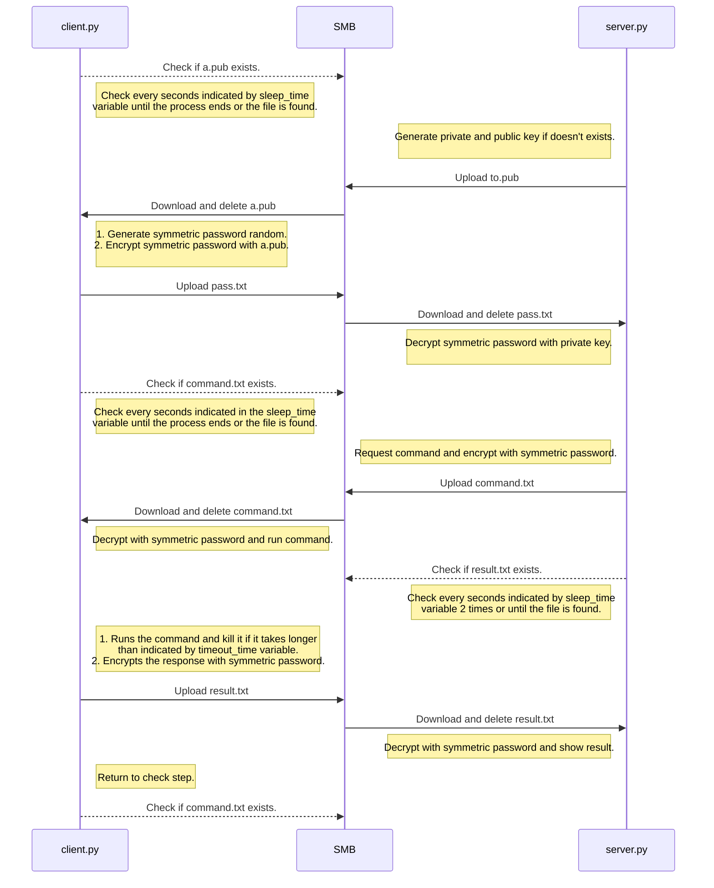

# SMB Shell

SMB Shell es una herramienta diseñada para manejar comunicaciones entre un atacante y una víctima a través de una conexión de un servidor SMB externo, permitiendo estabilizar una terminal interactiva de manera cifrada.

## Características

- Envío y recepción de comandos y respuestas mediante SMB.
- Cifrado de datos con AES y RSA.
- Generación dinámica de claves públicas y privadas.
- Ejecución remota de comandos cifrados.
- Comunicación bidireccional segura entre cliente y servidor.

## Instalacion

```bash 
git clone https://github.com/vpanal/smbshell.git
cd smbshell
pip install -r requirements.txt
```

## Compilado de client.py

```bash
# Sin ofuscar
pyinstaller  --onefile  --hidden-import  cryptography.hazmat.primitives ./client.py

# Compilado ofuscado
pyarmor  gen  ./client.py
cd dist
pyinstaller  --onefile  --add-data  "pyarmor_runtime_000000;pyarmor_runtime_000000"  --hidden-import  cryptography.hazmat.primitives  --hidden-import  cryptography.hazmat.primitives.serialization  --hidden-import  smb  --hidden-import  smb.SMBConnection  --hidden-import  cryptography.hazmat.primitives.padding  client.py

```

## Configuración

Se deben modificar los parámetros internos de los archivos client.py y server.py para la correcta configuración del servidor SMB y los tiempos de respuesta.

## Uso

### Ejemplo básico:

1. Inicia el servidor ejecutando `server.py`:

```bash
python server.py
```

2. Inicia el cliente ejecutando `client.py`:

```bash
python client.py
```

### Comandos del servidor

- **`help`**: Muestra una lista de comandos disponibles.
- **`quit`**: Cierra la sesión del atacante.
- **`exit`**: Finaliza la conexión con el cliente.
- Enviar un comando: Escribe cualquier comando válido de shell para ejecutarlo en el cliente.

### Notas

- Los archivos temporales se generan para manejar claves y datos, y se eliminan automáticamente después de su uso.
- Si quieres cerrar la sesión del cliente, utiliza el comando `exit`.

## Demo

### Flujo de ejecucion

A continuacion se muestra el flujo de ejecuccion de la aplicacion por defecto.



### Demostración de uso

<p align="left"></p>

## Notas de seguridad

Este script está diseñado únicamente para propósitos educativos y de pruebas en entornos controlados.  **No lo uses en sistemas sin autorización explícita.**

## Contribuciones

Si deseas contribuir, realiza un fork del repositorio, haz tus cambios y envía un pull request.

## Licencia

Este proyecto está bajo la Licencia MIT. Consulta el archivo  `LICENSE`  para más detalles.
