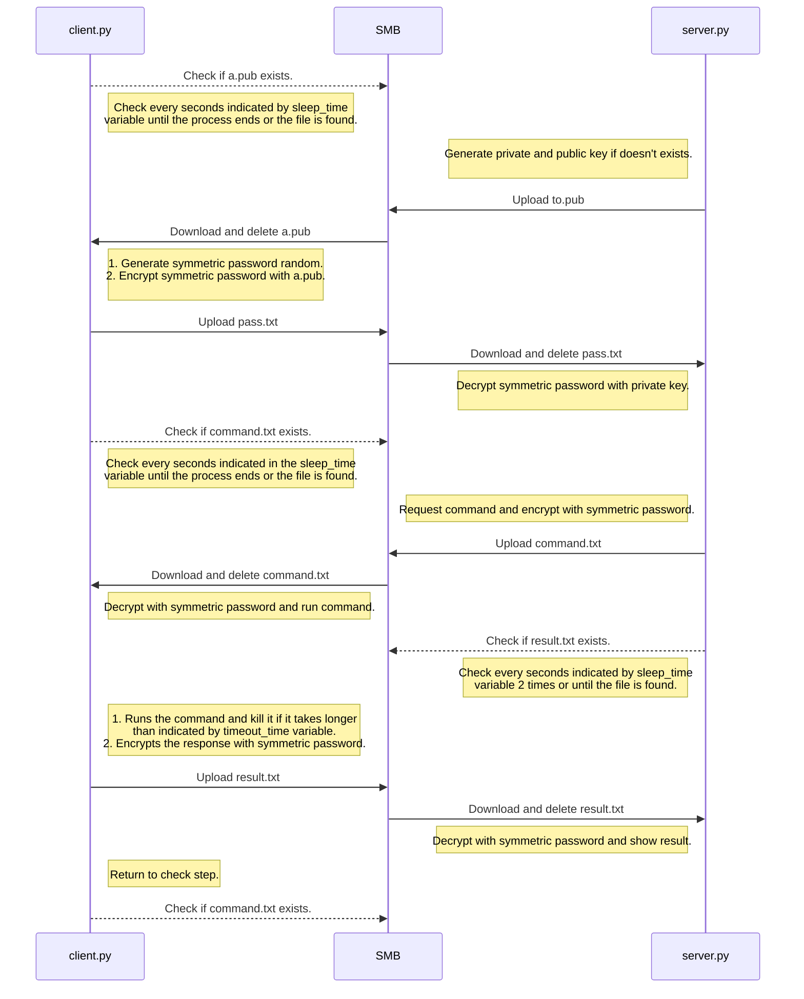

# SMB Shell

SMB Shell is a tool designed to handle communications between an attacker and a victim through an external SMB server connection, allowing to stabilize an interactive terminal in an encrypted manner.

## Features

- Sending and receiving commands and responses via SMB.
- Data encryption with AES and RSA.
- Dynamic generation of public and private keys.
- Remote execution of encrypted commands.
- Secure bidirectional communication between client and server.

## Installation

```bash
git clone https://github.com/vpanal/smbshell.git
cd smbshell
pip install -r requirements.txt
```

## Compiling client.py

```bash
# Without obfuscation
pyinstaller --onefile --hidden-import cryptography.hazmat.primitives ./client.py

# Obfuscated compilation
pyarmor gen ./client.py
cd dist
pyinstaller --onefile --add-data "pyarmor_runtime_000000;pyarmor_runtime_000000" --hidden-import cryptography.hazmat.primitives --hidden-import cryptography.hazmat.primitives.serialization --hidden-import smb --hidden-import smb.SMBConnection --hidden-import cryptography.hazmat.primitives.padding client.py
```

## Configuration

The internal parameters of the client.py and server.py files must be modified for the correct configuration of the SMB server and response times.

## Usage

### Basic example:

1. Start the server by running `server.py`:

```bash
python server.py
```

2. Start the client by running `client.py`:

```bash
python client.py
```

### Server commands

- **`help`**: Displays a list of available commands.
- **`quit`**: Closes the attacker's session.
- **`exit`**: Ends the connection with the client.
- Send a command: Type any valid shell command to execute it on the client.

### Notes

- Temporary files are generated to handle keys and data, and are automatically deleted after use.
- If you want to close the client's session, use the `exit` command.

## Demo

### Execution flow

Below is the default execution flow of the application.



### Usage demonstration

<p align="left"></p>

## Security notes

This script is designed for educational purposes and testing in controlled environments only. **Do not use it on systems without explicit authorization.**

## Contributions

If you want to contribute, fork the repository, make your changes, and send a pull request.

## License

This project is under the MIT License. See the `LICENSE` file for more details.
